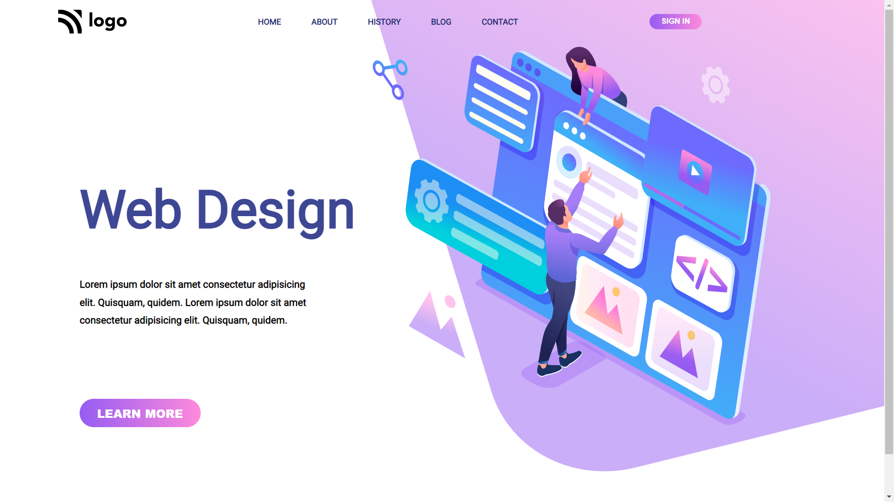

# Design Landing Page

`Author:` Padmanabh Belavadi

This is UI design Landing page of a Design Landing Website this is fully designed using core `HTML` and `CSS`.
This Project is a mobile responsive for laptop screen and mobile screen

## My Project Looks Like :

## My Learning From this Project are

- Organizing the `text` and `images` for good design of UI design
- Worked a Lot on `HTML` and studied how to manage sections
- Learnt about styling web pages using `Cascading Style Sheets (CSS)`
- Studied and Deep Dived into Flex box and it's properties
- I learn't a lot about position relative and absolute

## Reach Me Out on

- 
- 

## Time Taken to finish this project

- I had taken 5 hour to complete this one

## Deployed Link
[Design Landing Page](https://disign-ui-page.netlify.app/)
